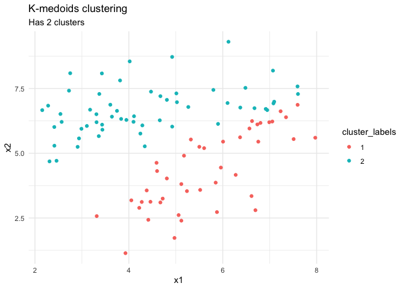

K-Medoids clustering
================
Koray Poyraz

2021

## The cost in K-Medoids algorithm is given as

```math
c=\sum_{C_i}\sum_{P_i\in C_i}|P_i-C_i|
```

## step 1: load lib and data

## step 2: A function for Euclidean distance

``` r
l2_dist = function(x, y){
  sqrt(sum((x - y)^2))
}
```

## step 3: K-Medioids clustering algorithm

Program a K-Medioids clustering algorithm called kmedioids. The inputs
of this function should be X, a data frame, and K, an integer stating
how many clusters you want. The output is at least the cluster
assignments (an integer vector). Use your l2_dist function to compute
the euclidean distance. Apply the kmedioids function on clus_df and
visualise your result.

``` r
# x = data frame and k = integer stating n clusters
kmedioids = function(X, k){
  # N rows
  L = nrow(X)

  # add new vars
  t_X = X %>% mutate(cost=0, label=0, med_id=0, i=1:L)
  
  # a rule for stopping the algo
  change = T
  # keeping track of iteration
  iter = 1
  # keeping track of already visited medoids for skipping
  visited = c()
  
  # reserve memory to update by using indexes with new labels
  t_label = rep(0, L)
  # reserve memory to update by using indexes with new costs
  t_cost = rep(0, L)
  # reserve memory to update by using indexes with new medoid ids
  t_med_id = rep(0, L)
  
  # looping until no change to medoids occurs
  while(change){
    # randomly select K medoids indexes (indexes from the data set)
    medoids_r = sample(1:L, k)
    
    # check if the pair already has been used, if yes then skip iteration else continue
    check = strtoi(str_c(medoids_r[1], medoids_r[2]))
    if(check %in% visited){
      next
    } else {
      visited = append(visited, check)
    }
    
    # visit each observation from the data set
    for(row_i in 1:L){
      # fetch a row from the data set
      row = t_X[row_i, ]
      
      # fetch initial index num of the medoid
      m_i = medoids_r[1]
      # fetch medoid row
      m = t_X[m_i, 1:2]
      # pre-define column index to update
      update_i = row[[length(row)]]
      
      # compute initial Euclidean distance cost to the first medoid
      d_score_old = l2_dist(row[1:2], m)
      # apply initial save
      t_cost[update_i] = d_score_old # saves cost
      t_label[update_i] = 1 # means cluster 1
      t_med_id[update_i] = m_i # saves index num (used in the data set) of the medoids
      
      # compare the cost with other medoids cost and update
      for(med_i in 2:length(medoids_r)){
        # fetch K-1 medoids index (other medoid so not the initial)
        m_i = medoids_r[med_i]
        # fetch medoid row
        m = t_X[m_i, 1:2]

        # compute Euclidean distance cost
        d_score_new = l2_dist(row[1:2], m)
        
        # compare old and new cost
        lower_dist_cost = d_score_old > d_score_new
        
        # if lower then update
        if(lower_dist_cost) {
          d_score_old = d_score_new
          t_cost[update_i] = d_score_new
          t_label[update_i] = med_i
          t_med_id[update_i] = m_i
        }
      }
    }
    
    # when 1st iteration then we just update the data frame with the initial cost and label
    if(iter != 1){
      # compute swap cost with new and old
      swap_cost = (sum(t_cost) - sum(t_X$cost)) < 0
      
      # compute swap when new total cost is lower then the old total cost otherwise terminate the algorithm
      if(swap_cost){
        t_X$cost = t_cost
        t_X$label = t_label
        t_X$med_id = t_med_id
      } else {
        change = swap_cost
      }
      
    } else {
      t_X$cost = t_cost
      t_X$label = t_label
    }
    
    # keep track of the iteration
    iter = iter + 1
  }

  # return new data frame with extra variables
  t_X
}

result = kmedioids(clus_df, 2)
```

plotting the clusters

``` r
# the clusters
cluster_labels = factor(result$label)
result %>% 
  ggplot(aes(x=x1, y=x2)) +
  geom_point(aes(color=cluster_labels)) +
  labs(title='K-medoids clustering', subtitle = str_c('Has ', length(levels(cluster_labels)), ' clusters')) +
  theme_minimal()
```

<!-- -->